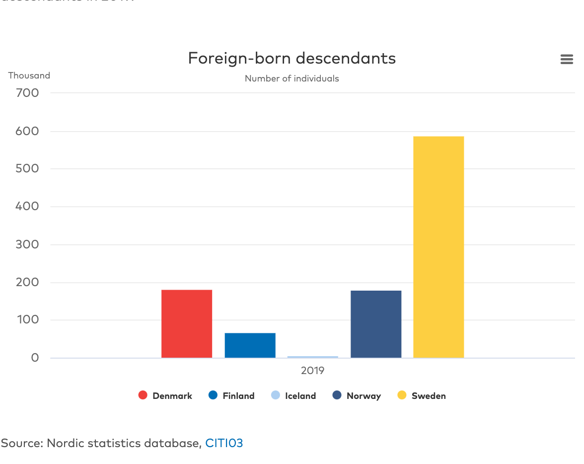

Sweden and Denmark are two seemingly similar countries, but they have differed in terms of immigration policy. Sweden has accepted many more individuals than Denmark as shown by the graph provided by Nordic Statistics below. 



  My research question is if this difference in policy has an effect on unemployment of immigrants of various backgrounds, specifically from Middle Eastern countries like Syria, Iran, and Iraq, and from Somalia. My original hypothesis is that Sweden, since it accepted more immigrants per its population than Denmark, may have a harder time finding work for immigrants (which could demonstrate difficulties in integration, and thus could help to explain the growth of the Sweden Democrats, the anti-immigration party, in the recent election, while Denmark hasn’t faced as extreme of issues so there politics have remained more stable). An observed pattern that would disprove my hypothesis, would be that Sweden has lower unemployment rates.
  An implication this topic may have is that in countries with large welfare states, as Scandinavia uniquely has, when certain parts of the population are unemployed and thus cannot contribute to the welfare state and have parallel societies, it may deteriorate trust in the safety net or in the parties who allowed the situation to occur. GDP of the origin countries may also play a role in how easily the immigrants can find employment since countries with higher GDPs may have higher educatucated, better trained people for the work force.  
  The explanatory variables of interest are comparing the rate of unemployment for immigrants aged 20-29, born in a foreign country with two foreign-born parents in Sweden versus Denmark. The dependent variable are the migrants country of origin and its GDP. I hypothesize there is a correlation between the origin countries' GDP and the success of employment of those people in Sweden and Denmark. 
 

The source of my data was Nordic Statistics (National Statistical Institutes)

###### https://pxweb.nordicstatistics.org/pxweb/en/Nordic%20Statistics/Nordic%20Statistics__Integration%20and%20migration__Labour%20market/LABO30.px/

 Its Latest update was 3/17/2021, however the data unfortunately only goes to 2018, and they do not plan on updating it anytime soon. It is a collection of comparative Nordic statistics which has existed and been funded by the Nordic Council of Ministers since the mid-1960s. The data is gathered from the Nordic Statistical Institutes (NSIs), the Nordic Health and Welfare Statistics database maintained by the Nomesco-Nososco committees, other Nordic statistics producers as well as international sources such as Eurostat, OECD and the UN. My data was a cross-sectional study since it was an observational study of collected at given points in time across a sample population (immigrants from these countries of origin in Sweden and Denmark in 2016, 17 and 18) being a pre-defined subset.

and for GDP in USD Billions the source was the World Bank Open Data.
###### https://data.worldbank.org/

I will load packages in R and the data from a 'comma seperated values' list. 
```{r, setup}
library(tidyverse)
library(infer)

work1 <- read_csv("swdden - alma.csv")|>
    mutate(binary = if_else(dest_country == "Denmark", 1, 0))

```

To preview the data: 
```{r}
head(work1)
```
Now I will work with the data to present 5 visualizations. 
One of Denmark and then one of Sweden's unemployment rates each year from 2016 to 2018 by each of the 4 country of origins. Then one for the most recent year in the data comparing the two recieving countries side by side. 4th there is a bar plot of the GDPs of the origin countries, which when comparing to the previous graphs one sees evident similarities. And for the final visualization, I use Syrian youth unemployment as a scatter plot comparing points in Sweden and Denmark, quite clearly showing Denmark as higher consistently throughout the years, and an overall decline in unemployment rate amoung those with Syrian background. I tried to plot all the countries, but it was hard to differentiate then among origin country. 

```{r}
viz1 <- visualization <- work1 |> 
  filter(binary == 1) |>
  ggplot(aes(x = `year`, y = `fb_pct_2par`)) +
  geom_col(mapping = aes(fill = `origin`), 
           position = "dodge") +
  labs(x = "Year", 
       y = "Unemployment as Proportion / 100", title = "Denmark Prop. of Immigrant Youth pop. w/ No Work or Study")
  

viz1
```
```{r}
viz2 <- visualization <- work1 |> 
  filter(binary == 0) |>
  ggplot(aes(x = `year`, 
             y = `fb_pct_2par`)) +
  geom_col(mapping = aes(fill = `origin`), position = "dodge") +
  labs(x = "Year", 
       y = "Unemployment as Proportion / 100", 
       title = "Sweden Prop. of Immigrant Youth pop. w/ No Work or Study")

viz2
```
```{r}
viz3 <- visualization <- work1 |> 
  filter(year == "2018")|>
  ggplot(aes(x = `dest_country`, 
             y = fb_pct_2par)) +
  geom_col(mapping = aes(fill = `origin`), position = "dodge") +
  labs(x = "Destination Country", 
       y = "Unemployment Rate", 
       title = "2018 Prop. of Immigrant Youth pop. Denmark v Sweden")

viz3
```

```{r}
GDPplot <- work1 |>
  ggplot(aes(x= origin, y = GDP)) +
  geom_col(mapping = aes(fill = `origin`)) +
  labs(title = "GDP in USD Billions of 4 Origin Countries" ,
       x = "Country")

GDPplot
```


```{r}
viz5 <- work1 |> 
  filter(origin == "Syria") |>
  ggplot(aes(x = `year`, y = `fb_pct_2par`)) +
  geom_point(mapping = aes(color = `dest_country`)) +
  labs(y = "Unemployment as Proportion / 100", 
       title = "Sweden vs Denmark Unemployed Youth Syrian Immigrant Pop.") + 
  geom_smooth(color = "yellow", alpha = .05) 

viz5
```


```{r}
 ate<- work1 |>
  group_by(dest_country) |>
summarize(unemp = mean(fb_pct_2par)) |> 
  pivot_wider(names_from  = dest_country, values_from = unemp)|>
  mutate(ATE = `Denmark` - `Sweden`) |>
  knitr::kable(digits = 3, 
               caption = " ATE = Difference in Unemployment amoung 20-29 year old immigrants")

ate

```

Could this difference be due to random chance? I will run a randomized repeated sample of 1000 repetitions to see if the difference will still be present with more than simply one instance. 

```{r}
set.seed(02138)

ate_boots <- work1|>
specify(fb_pct_2par ~ dest_country) |>
generate(reps = 1000, type = "bootstrap") |>
  calculate(stat = "diff in means", 
            order = c("Denmark", "Sweden"))

ate_boots|>
  visualize()+
  labs(x = "Difference Distribution", y= "Count")

 ate_boots |>
   get_confidence_interval(level = .95, type = "percentile")
```
Since our confidence interval does not contain 0, I can reject the null, and say there is a difference in unemployement amoung those with immigrant background (from these 4 countries) in Denmark and Sweden, with Denmark having higher unemployment rates. 


Here is one multiple regression, lm(Y ~ X), with multiple explanatory/independent variables being the country's GDP and the country of origin. 
```{r}
lmalt<- lm(fb_pct_2par ~ GDP  + origin, work1)

modelsummary::modelsummary(lmalt,
                           statistic = c("s.e. = {std.error}",
                                         "p = {p.value}"),
                           gof_map = c("nobs", "r.squared", "adj.r.squared"))
```

  To interpret the numbers above, the GDP is my explanatory variable, and the foreign born unemployment rate is my dependent variable. So to explain the main coefficient of interest in your regression, for every 1 unit increase in GDP (in billions), there is an expected -first number on every section- increase or decrease in the unemployment rate, holding the country of origin constant. (However most of the numbers are positive, which is in contradiction to my correlation test further below, so it is a bit confusing.) To comment on the statistical significance of the estimated coefficients, using an alpha of .05 as a guage, none are small enough to say that they are statistically significant. Their standard errors are also quite large, which makes sense since there is not that big of a sample size n, so in dividing by a smaller number, it would make the s.e. larger. 
There is not enough evidence to say the coefficients represent a causal effect, however is there a correlation between unemployment rate and GDP of the origin countries? 

```{r}
cor.test(work1$GDP, work1$fb_pct_2par)
```
There is a medium negative correlation between GDP and unemployment rate, which makes sense - as the countries GDP increases, the unemployment rate would decrease. 


  In conclusion, from the years 2016-2018, Denmark had higher rates of unemployment, contrary to my initial belief that Sweden would because it had taken in more people. This difference does not seem to random, as a simulation-based bootstrap distribution, still indicates there would be a difference of Denmark having higher unemployment rates of immigrants during this time. In both Denmark and Sweden, youth immigrants from Syria have the hardest time finding employment as shown in the vizualizations, and people originating from Somalia as second highest unemployment rates, which these are the two countries with the lowest GDP. There is a moderate correlation between GDP and unemployment rate, but the multiple linear regression model was unclear and not statistically significant, perhaps in part due to the low number of data points in this set, which was a major limitation.
  My original intrest question was overall is there a difference of *time* in Sweden vs Denmark for migrants to find employment. Looking at the time it takes to find employment would be a more intresting research topic I think than simply unemployment rates, because it shows how easily or difficult it is to find employment depending on how many years it takes. I spoke to a former prime minister of Sweden, and he said it used to be 9 years to find employment on average for immigrants, but now it is only 4, but I could not find this data, so I went with 20-29 year old unemployment rates instead. I suppose looking at a specific age range helped account for the time factor in a sense. I also wish that I could have done it with data to 2021, because it would give me more data points to work with, and would perhaps help me see if my original hypothesis was true, that it only took time for more salient problems to appear. I wish I would have also included Afghanistan since Sweden admitted many refugees from there as well. Another potential limitation is that I used general country GDP data indicating the size of their economy, when GDP per capita may have provided different results, showing more general living conditions. 
  A takeaway may be that unemployment itself may just be one of the many factors that is not as big of a factor as it seems in regards to why Sweden's right party has risen, which that in itself is an interesting find, that it is not statistically significant during this time period. Perhaps it is a factor, but not the only one, and maybe I could also look at residential segregation, crime rates, school testing grades and standards and absenteeism, health care wait times, etc. Although this has been in regards to the specific Nordic case and it is a current significant question for political science because people are immigrating to countries that have seen very little immigration in the past and are doing so in large numbers, people in all countries can in some fashion relate to the topic, and it will continue to be perhaps the most important polical topic of our lifetimes. 


